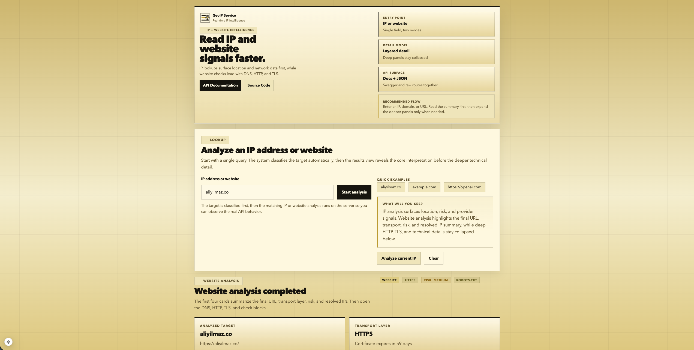
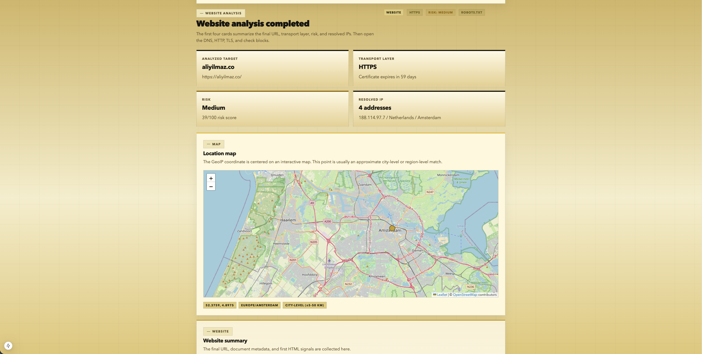
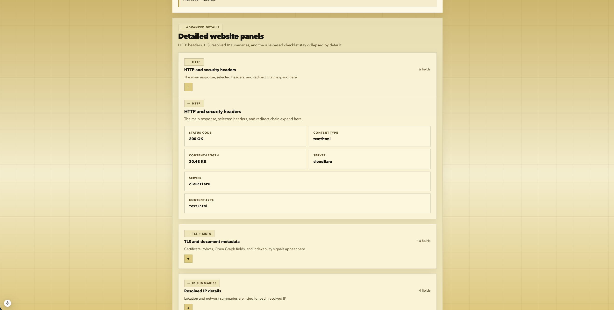

# GeoIP Service

[](https://nextjs.org/)
[](https://www.typescriptlang.org/)
[](LICENSE)
[](http://ip.aliyilmaz.co/docs)

GeoIP Service is a Next.js application that analyzes both IP addresses and website targets through a single lookup flow. It combines geolocation, ISP enrichment, device and connection signals, website DNS/HTTP/TLS inspection, and interactive Swagger documentation.

<p align="center">
  
</p>

<p align="center">
  
</p>

<p align="center">
  
</p>

## Contents

- [Overview](#overview)
- [Features](#features)
- [Endpoints](#endpoints)
- [Getting Started](#getting-started)
- [Usage](#usage)
- [Response Notes](#response-notes)
- [Project Structure](#project-structure)
- [Development](#development)
- [Troubleshooting](#troubleshooting)
- [License](#license)

## Overview

The service supports two main analysis modes:

- IP lookup: analyzes the current client IP or a provided IPv4/IPv6 address.
- Website lookup: accepts a domain or full HTTP/HTTPS URL, then inspects DNS, redirects, HTTP response metadata, TLS certificate data, and basic SEO/security signals.

The web UI is designed for progressive disclosure. Summary cards surface the most important interpretation first, while deeper technical panels stay collapsed until needed.

## Features

- Unified target detection for IPs, domains, and full URLs
- Geographic location estimates with country, region, city, timezone, and coordinates
- ISP enrichment with ASN, organization, proxy, hosting, and mobile connection signals
- Device and browser parsing from request headers
- Risk scoring, suspicious header detection, and bot heuristics
- Optional Turso-backed persistence for target lookup history and latest resolved IP inventory
- In-memory rate limiting with `Retry-After` and `X-RateLimit-*` headers for lookup and Swagger traffic
- Website inspection for DNS, redirects, status codes, headers, TLS, robots.txt, sitemap.xml, and HTML metadata
- Interactive Swagger UI backed by a live OpenAPI spec
- JSON-first API responses that mirror what the UI renders

## Endpoints

- `GET /api/lookup`
  Returns analysis for the current client IP.
- `GET /api/lookup?target={target}`
  Accepts an IP address, domain, or full URL and auto-detects the appropriate analysis mode.
- `GET /api/lookup/{target}`
  Compatibility route for manual path-based targets.
- `GET /api/swagger`
  Returns the OpenAPI JSON spec used by Swagger UI.
- `GET /docs`
  Loads the embedded Swagger UI page.

## Getting Started

### Requirements

- Node.js 22 or newer
- npm 8 or newer

### Install

```bash
git clone https://github.com/aliyilmazco/geoip-service.git
cd geoip-service
npm install
```

### Optional GeoIP Data Refresh

```bash
npm run update-geo
```

### Environment Configuration

```bash
cp .env.example .env.local
```

Recommended defaults:

- Keep `TRUST_PROXY_HEADERS=false` during local development unless you are behind a trusted reverse proxy.
- Leave `GEOIP_DATA_PATH` empty unless you need to force a custom GeoIP data directory.
- Keep `ALLOW_INSECURE_IP_API=false` unless you explicitly want the optional `ip-api.com` ISP enrichment fallback.
- Set `PUBLIC_APP_URL` and `SUPPORT_EMAIL` so the generated OpenAPI document matches your deployment.
- Set `TURSO_LOGGING_ENABLED=true`, `TURSO_DATABASE_URL`, and `TURSO_AUTH_TOKEN` if you want target lookups written to Turso.

### Start the Development Server

```bash
npm run dev
```

The app runs on `http://localhost:3001`.

## Usage

### Web UI

1. Open `http://localhost:3001`.
2. Enter an IP address, domain, or full URL.
3. Review the summary cards first.
4. Expand the advanced panels if you need HTTP, TLS, request context, or connection detail.

### API Examples

Analyze the current client IP:

```bash
curl http://localhost:3001/api/lookup
```

Analyze a specific IP address:

```bash
curl "http://localhost:3001/api/lookup?target=8.8.8.8"
```

Analyze a domain:

```bash
curl "http://localhost:3001/api/lookup?target=example.com"
```

Analyze a full URL:

```bash
curl "http://localhost:3001/api/lookup?target=https://openai.com"
```

Use the compatibility path route:

```bash
curl "http://localhost:3001/api/lookup/8.8.8.8"
```

Fetch the OpenAPI spec:

```bash
curl http://localhost:3001/api/swagger
```

### JavaScript Example

```ts
const response = await fetch("/api/lookup?target=example.com");
const data = await response.json();

if (!response.ok) {
  console.error(data.error);
} else {
  console.log(data.lookupType, data.requestId, data);
}
```

## Response Notes

- Field names remain stable across UI and API usage.
- Responses now include stable `status`, `requestId`, and `timestamp` fields.
- Lookup responses include top-level `rateLimit` metadata, and public endpoints expose matching `X-RateLimit-*` or `Retry-After` headers.
- Repeated requests can return `429 Too Many Requests` with `Retry-After` guidance.
- Error responses always include a structured `details.code` value.
- Human-readable values such as `error`, `reason`, `recommendations`, and risk labels are English.
- Website lookups may return partial technical data even when a full fetch fails.
- When location data cannot be produced, `location.diagnosis` can explain whether the GeoIP database was unavailable, the IP had no GeoIP match, or ISP fallback was disabled/missed.
- Local or private IP addresses can return limited location data while still exposing device, request, and risk signals.
- Bare `GET /api/lookup` current-IP requests are not persisted, but target-based lookups can be retained in Turso when logging is enabled.
- Website probes reject loopback, private, link-local, and other non-public targets before DNS, HTTP, or TLS probing continues.

## Project Structure

```text
app/
  api/lookup/              Query-based lookup endpoint (GET /api/lookup)
  api/lookup/[...target]/  Path-based catch-all route (GET /api/lookup/{target})
  api/swagger/             OpenAPI spec endpoint
  docs/                    Embedded Swagger UI page
  page.tsx                 Main lookup interface
  layout.tsx               Root layout with metadata
  globals.css              Global styles and CSS custom properties
components/
  geoip-result-view.tsx    Result rendering and advanced technical panels
  location-map-panel.tsx   Map container with dynamic loading
  location-map-canvas.tsx  Leaflet-based interactive map
  site-chrome.tsx          Shared hero and footer UI
  swagger-ui-embed.tsx     Swagger UI React wrapper
lib/
  geoip-safe.ts            GeoIP database wrapper with fallback
  ip-analysis.ts           IP, device, risk, and network helpers
  ip-lookup.ts             Targeted IP lookup flow
  logger.ts                Event logging utility
  lookup-dispatch.ts       Route target dispatcher
  lookup-log-store.ts      Turso persistence layer
  lookup-response.ts       Structured response builders
  lookup-target.ts         Target classification and normalization
  lookup-types.ts          TypeScript type definitions
  network-policy.ts        IP scope and hostname policy checks
  request-utils.ts         Request context and client IP utilities
  runtime-config.ts        Environment variable parsing with defaults
  security.ts              Rate limiting, URL validation, sanitization
  swagger.ts               OpenAPI schema definition
  ttl-cache.ts             In-memory TTL cache
  turso.ts                 Turso database client
  website-analysis.ts      Website DNS, HTTP, TLS probing
scripts/
  dev-preflight.js         Pre-dev port conflict detection
  clean-next.js            Build artifact cleanup
  port-guard.js            Port availability checker
tests/
  routes.test.ts           API route integration tests
  lookup-target.test.ts    Target classification tests
  security.test.ts         Rate limiting and security tests
  lookup-persistence.test.ts  Turso persistence tests
public/
  brand/                   Logo and brand assets
  sw.js                    Cleanup service worker
```

## Development

### Available Scripts

- `npm run dev` starts the development server on port `3001` using `.next-dev`
- `npm run dev:clean` clears both `.next-dev` and `.next` before starting
- `npm run build` creates a production build
- `npm run start` starts the production server on port `3001`
- `npm run lint` runs Next.js linting
- `npm test` runs the Node.js test suite with TypeScript stripping
- `npm run update-geo` refreshes the `geoip-lite` data

### Documentation

After starting the app locally:

- Home page: `http://localhost:3001`
- Swagger UI: `http://localhost:3001/docs`
- OpenAPI JSON: `http://localhost:3001/api/swagger`

## Troubleshooting

### Location data is missing for an IP

- Check whether the IP is private or local.
- Try a public IP address such as `8.8.8.8`.
- Refresh the GeoIP dataset with `npm run update-geo`.

### Website analysis returns limited data

- Verify that the target domain resolves publicly.
- Confirm the site is reachable over HTTP or HTTPS.
- Retry with a full URL if the domain redirects in a non-standard way.
- Loopback, private, link-local, and internal targets are rejected by design.

### Local development server does not start

- Make sure port `3001` is available.
- Reinstall dependencies with `npm install` if the lockfile changed.
- Stop any older Next.js process before starting a new one on the same port.
- Run `npm run dev:clean` after switching branches, after `npm run build`, or after editing routes, layouts, or global CSS.

### Development shows `MODULE_NOT_FOUND` for `.next` or `.next-dev` chunks

- This usually means a running dev server is reading stale server chunks.
- Development output now lives in `.next-dev`, while production build output stays in `.next`.
- Do not run `next dev` directly; use `npm run dev` or `npm run dev:clean` so the guard scripts can stop port and chunk drift issues.

### `GET /sw.js 404` appears in the browser console

- Older browsers may still try to update a previously registered service worker.
- This project now serves a cleanup worker at `/sw.js` to clear stale caches and unregister that old worker.
- After one refresh cycle, the repeated `sw.js` 404 log should disappear.

### GeoIP falls back to `null`

- The API can continue to respond even if `geoip-lite` cannot load its local database.
- At runtime the service checks `GEOIP_DATA_PATH`, `GEODATADIR`, `node_modules/geoip-lite/data`, `public/data`, `.next/server/data`, and `.next-dev/server/data` in that order.
- Check that at least one of those directories contains the GeoIP `.dat` files, and refresh the package data with `npm run update-geo` if needed.
- If a lookup still returns no coordinates, inspect `location.diagnosis` in the API response for the immediate cause.

### Test runner shows loader warnings

- `npm test` uses a small custom loader so Node can resolve the repo's `@/` import alias during the test run.
- On newer Node versions you may still see experimental loader warnings; these warnings do not fail the suite.

## License

This project is licensed under the MIT License. See [LICENSE](LICENSE) for details.
